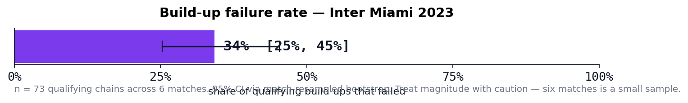
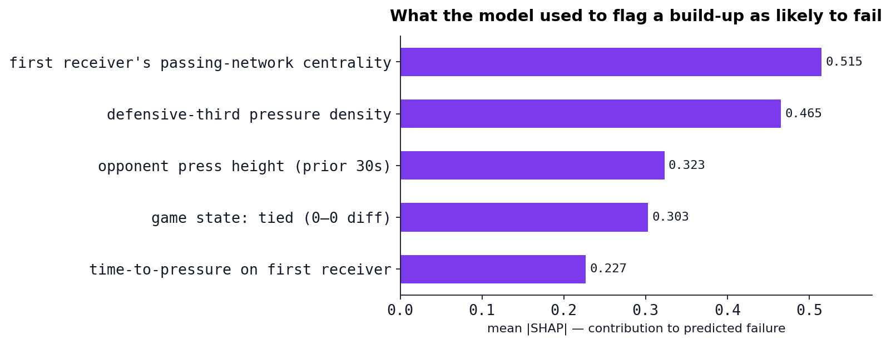
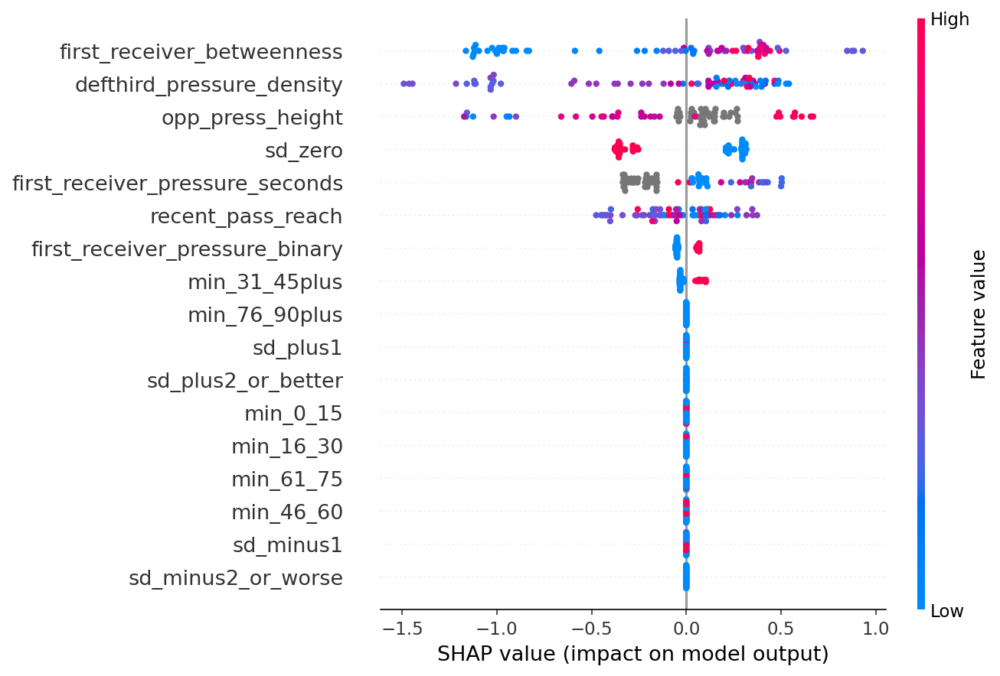
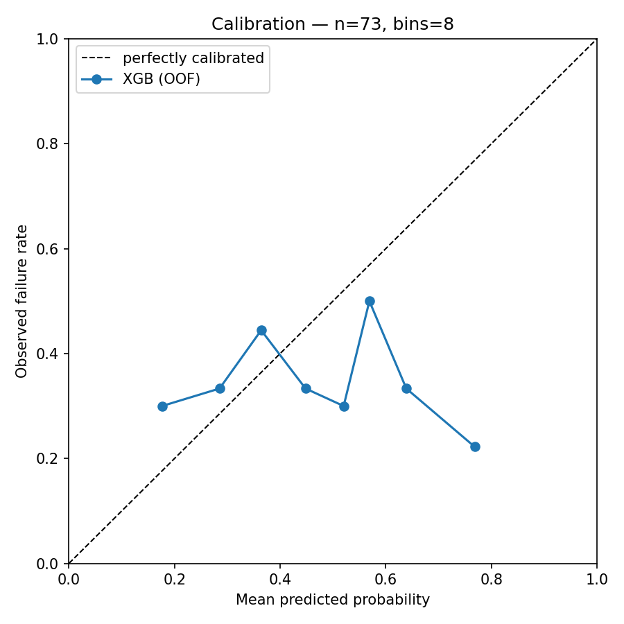
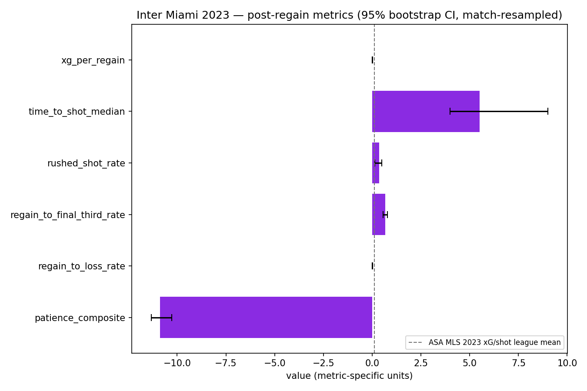
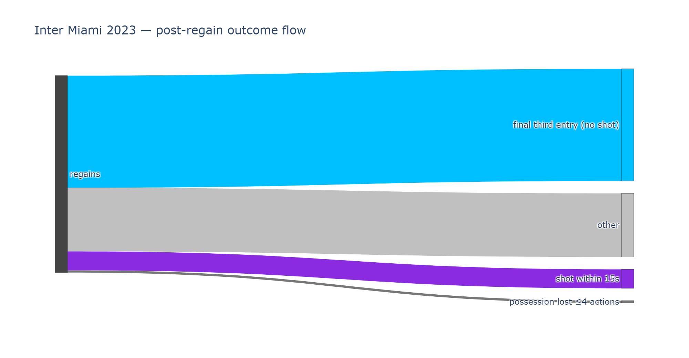
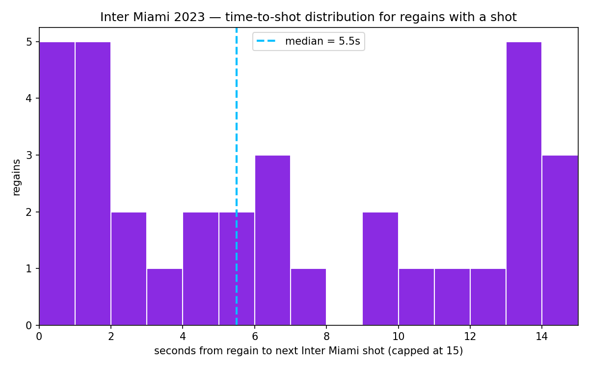
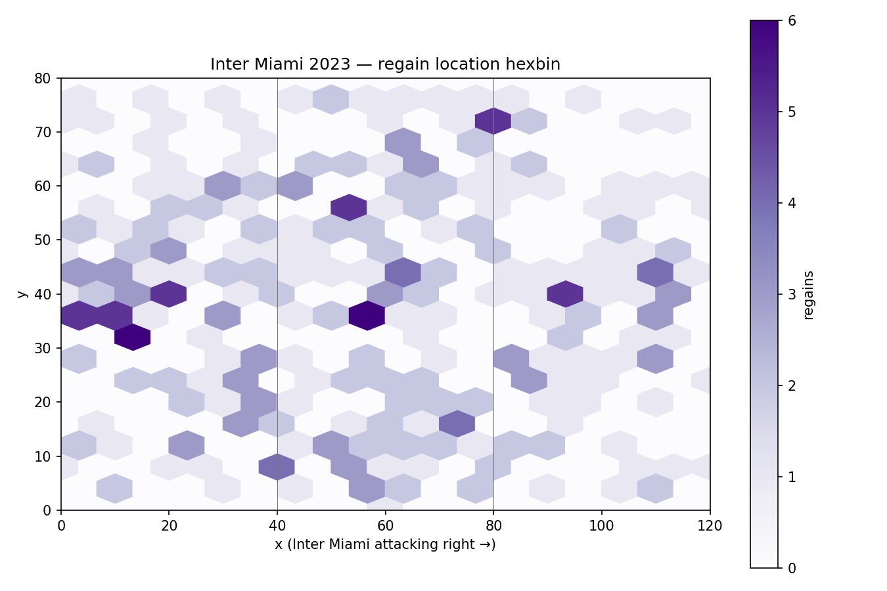
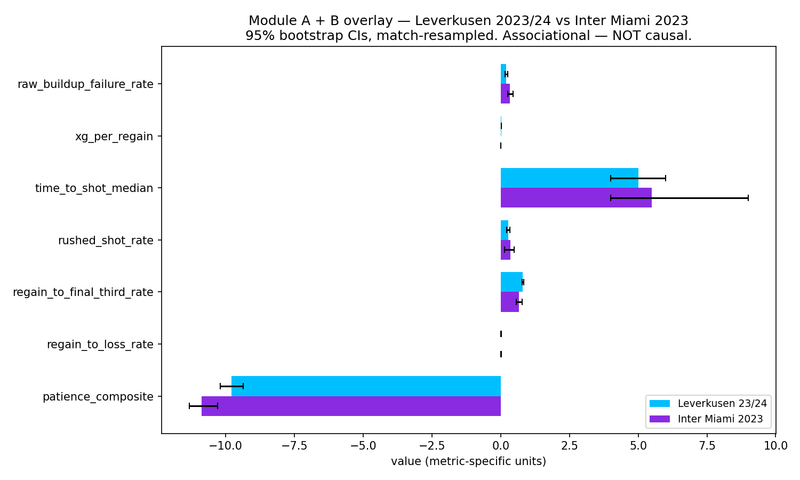
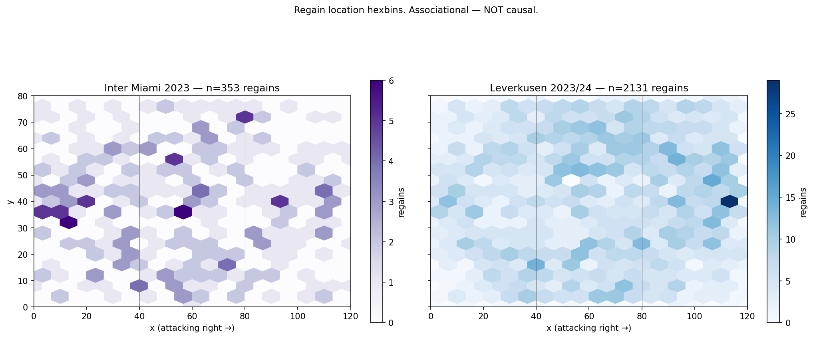

# Pressured Progression

**Two MLS failure modes — build-up collapse under pressure and post-regain waste — measured on Inter Miami 2023 (Messi's half-season, 6 matches) and benchmarked against Bayer Leverkusen 2023/24 (Alonso's unbeaten season, 34 matches) using StatsBomb Open Data and the American Soccer Analysis API.**

**Built with:**


---

## Contents

- [What this project does](#what-this-project-does)
- [The two failure modes](#the-two-failure-modes)
- [Key findings](#key-findings)
- [How it's measured (methodology)](#how-its-measured-methodology)
- [The machine-learning model](#the-machine-learning-model)
- [Every metric, with uncertainty](#every-metric-with-uncertainty)
- [Visual gallery](#visual-gallery)
- [Data reality — why the scope is what it is](#data-reality--why-the-scope-is-what-it-is)
- [Architecture & pipeline](#architecture--pipeline)
- [Tech stack](#tech-stack)
- [Data marts (outputs)](#data-marts-outputs)
- [The Streamlit dashboard](#the-streamlit-dashboard)
- [Testing](#testing)
- [Notebooks](#notebooks)
- [Reproduce](#reproduce)
- [Data sources](#data-sources)
- [Scope and limitations](#scope-and-limitations)
- [Conclusion](#conclusion)
- [Author + contact](#author--contact)

---

## What this project does

**The question.** When an elite attacking team is pressed deep in its own half, how often does its build-up collapse — and once the ball is won back, how often does that regain actually become a threat? These are two distinct failure modes a football team can fall into, and this project puts numbers on both of them for one MLS team and one European comparator that event-level open data can support.

**The approach.** Every on-ball event across 40 matches (6 Inter Miami, 34 Leverkusen) is parsed into possession chains via the StatsBomb schema. Build-up sequences are labeled failure/not-failure by explicit rules; regains are detected and their aftermath measured; an XGBoost classifier with SHAP attribution probes whether collapse-shaped possessions carry a measurable geometric signature. Every team-season rate carries a **match-resampled 95% bootstrap confidence interval**, and every claim is **associational, not causal**.

**What it is as a deliverable.** An end-to-end, reproducible pipeline built entirely on **open data**: raw ingestion → typed/validated core tables → analysis-ready marts → interpretable ML → bootstrap-CI figures → a one-page executive PDF → an interactive multi-page Streamlit app → a long-form written article. Every number in every chart traces back to a file in `data/marts/` and a line of code.

- **Package:** `pressured-progression` (v0.1.0) · **Python:** 3.11+ · **License:** MIT

---

## The two failure modes

**1 — Build-up collapse under pressure.** The "chasing shadows in your own half" scenario. A build-up sequence is flagged when possession **starts in the defensive third** (`start_x < 40` on a 0–120 pitch) **and** an **opponent pressing action appears within the first 3 touches**, then terminates via one of four failure endings (turnover in own half, forced long ball, opponent shot within 10s, or a backward reset that leads to a loss). Plainly: you're trying to climb out while someone leans on you, and you don't manage it.

**2 — Post-regain waste.** Shifts the clock forward one beat: what does the team do with a **newly won** ball? A **regain** is a defensive action (interception, tackle, ball recovery, duel, block) that flips possession to the focal team. The subsequent chain is measured for final-third entry, time-to-shot, xG, rushed-shot rate, and quick re-loss. If the ball returns and the next few seconds behave like hurry rather than setup, the window is scored as wasted.

Both modes coexist in real football; **neither implies the other**. Collapse is about buildup under harassment; waste is about the impulse right after flipping the ball.

---

## Key findings

- **Inter Miami 2023 build-up failure rate:** **34%** [95% CI 25–45%] across **73** qualifying chains in 6 matches.
- **Post-regain waste:** **90%** of Inter Miami's **353** regains produced no shot within 15 seconds (319 of 353); median time-to-shot when shots happened was **5.5 s**.
- **Leverkusen 2023/24 failure rate:** **21%** [95% CI 16–25%] across **394** chains in 34 matches — **14 percentage points lower** than Inter Miami (CI excludes zero).
- **Leverkusen final-third entry after regain:** **81%** vs Inter Miami **67%** — a **+14 pp** difference (CI excludes zero).
- Leverkusen is materially better on **4 of 7** cross-team metrics at 95% confidence (failure rate, final-third entry, xG per regain, patience composite). The other three (time-to-shot, rushed-shot rate, quick-loss) are **not separable from noise** at this sample size.
- **Model utility is modest at small n.** XGBoost CV ROC-AUC **0.54 ± 0.08** on 73 chains — a logistic-regression baseline (0.585) actually beats it. Reported honestly, with no overstatement.

### Sample visual

Cross-team difference forest plot (Leverkusen 23/24 − Inter Miami 2023, 95% bootstrap CI per metric). Cyan markers = CI excludes zero; gray = CI overlaps zero.


---

## How it's measured (methodology)

The analysis is organized into three modules on top of shared sequence-building primitives.

### Shared primitives
- **Possession chains** (`sequences/possession_chain.py`) — consecutive on-ball events owned by one team within a StatsBomb possession block, keyed `(match_id, possession_id)`. Each chain carries start/end coordinates, `action_count`, `under_pressure_count`, an `end_type` (goal/shot/loss/clearance/foul_won/half_end), and the first receiver.
- **Regains** (`sequences/regain.py`) — a defensive action `{Interception, Ball Recovery, Tackle, Duel, Block}` by the focal team that flips possession to it. Pitch zones by x: `<40` defensive, `40–80` middle, `≥80` attacking. The next focal shot is searched within a **15-second window**.
- **Column contracts** (`core/schemas.py`) — Pydantic schemas (`EventRow`, `PossessionChain`, `RegainEvent`, `BuildUpFailureLabel`) with a `validate_columns()` guard called at every stage boundary.

### Module A — build-up failure (labeling + interpretable ML)
A chain **qualifies** if it originates in the defensive third (`start_x < 40`) and faces opponent pressure within the first 3 actions. Qualifying chains get the **first matching** failure type, in priority order:
1. `turnover_own_half` — turnover terminal in own half (`x < 60`).
2. `forced_long_ball` — a pass longer than **40 m** near the end of the chain.
3. `opp_shot_within_10s` — opponent shoots within 10 s of the chain ending.
4. `backward_reset_turnover` — a backward pass (`pass_end_x < location_x − 5`) followed by a loss.
5. `none` — not a failure.

Each qualifying chain is turned into a **17-feature** vector (`features/buildup_features.py`): defensive-third pressure density, first-receiver pressure (binary + seconds), recent pass reach, opponent press height (in the opponent's attacking frame), first-receiver passing-network betweenness, plus one-hot score-differential (`sd_*`) and minute (`min_*`) buckets. *(The planned `support_density_ff` feature was dropped — it needs 360 freeze-frame data that 404s; see below.)*

### Module B — post-regain waste (`features/post_regain.py`)
Each regain's subsequent chain is scored for `reached_final_third` (any `x ≥ 80`), `lost_within_4_actions`, and `chain_end_type`. Six team-season metrics are aggregated with **match-resampled bootstrap CIs** (`n_boot = 1000`, `seed = 20260421`): xG per regain, median time-to-shot, rushed-shot rate (xG < 0.05 and < 8 s), final-third entry rate, quick-loss rate, and a **patience composite** = `z(xg_per_regain) − z(rushed_shot_rate)` against an ASA league baseline.

### Module C — the Leverkusen overlay (`analysis/leverkusen_overlay.py`)
Computes Leverkusen 23/24's raw failure rate + the six Module B metrics and overlays them side-by-side against Inter Miami 2023, with **independently match-resampled difference CIs** and a `ci_excludes_zero` flag per metric. *(The originally planned pre/post-vs-2022/23 comparison was dropped — Bundesliga 2022/23 is absent from Open Data.)*

---

## The machine-learning model

`models/buildup_failure_xgb.py` trains the Module A classifier with methodology chosen for a small, leakage-prone sample:

- **Cross-validation:** `GroupKFold(5)` grouped by `match_id` so entire matches stay together across folds.
- **Baseline:** balanced logistic regression (StandardScaler → LogReg).
- **Model:** XGBoost via `RandomizedSearchCV` (`n_iter=30`, `scoring="roc_auc"`) over depth, learning rate, estimators, min-child-weight, subsample, and colsample; `scale_pos_weight` handles class imbalance.
- **Calibration:** isotonic `CalibratedClassifierCV`; a raw XGB is also refit for SHAP.
- **Small-n leakage check:** requires `holdout_AUC > CV_mean − threshold`, where the threshold **scales with n** (0.10 if n<200, else 0.05) — because at n=73 any held-out fold can swing ±0.08 by chance.
- **Interpretation:** `shap.TreeExplainer` on the raw XGB → global mean-|SHAP| rankings.

**What the model honestly showed:** tuned XGBoost (0.538 AUC) **underperforms** the LogReg baseline (0.585) on discrimination and wins only on Brier score; calibration zigzags across the diagonal. Gain importance favors game-state buckets while mean |SHAP| favors pressure geometry (`first_receiver_betweenness`, `defthird_pressure_density`, `opp_press_height`) — an expected divergence. The model is presented as an **illustrative, small-n** exercise, not a deployable scout.

---

## Every metric, with uncertainty

**Inter Miami 2023 — six post-regain metrics** (`data/marts/team_post_regain.csv`, n = 353 regains):

| Metric | Estimate | 95% CI |
|---|---:|---|
| xG per regain | 0.00827 | [0.0044, 0.0135] |
| Time-to-shot (median s) | 5.5 | [4.0, 9.0] |
| Rushed-shot rate | 0.353 | [0.136, 0.485] |
| Final-third entry rate | 0.669 | [0.568, 0.772] |
| Loss-within-4-actions rate | 0.0113 | [0.0027, 0.024] |
| Patience composite* | 10.878 below reference | [10.28, 11.32] below |

<sub>*Patience composite is a relative z-index; "below reference" means below the ASA MLS 2023 league mean (z = 0). A higher value (closer to zero) = more patient, higher-quality post-regain attacking.</sub>

**Leverkusen 23/24 vs Inter Miami 2023 overlay** (`data/marts/leverkusen_overlay.csv`), read as *how Leverkusen compares to Inter Miami*:

| Metric | Leverkusen | Miami | Leverkusen vs Miami | Separable at 95%? |
|---|---:|---:|---|:---:|
| Raw build-up failure rate | 0.206 | 0.342 | **0.137 lower** — CI [0.035, 0.262] | ✅ |
| xG per regain | 0.0178 | 0.00827 | **0.0096 higher** — CI [0.0032, 0.0159] | ✅ |
| Final-third entry rate | 0.808 | 0.669 | **0.140 higher** — CI [0.020, 0.250] | ✅ |
| Patience composite | 9.79 below ref | 10.88 below ref | **1.09 higher** — CI [0.37, 1.80] | ✅ |
| Time-to-shot (median s) | 5.0 | 5.5 | ~0.5 shorter — within noise | ❌ |
| Rushed-shot rate | 0.278 | 0.353 | ~0.075 lower — within noise | ❌ |
| Loss-within-4-actions rate | 0.0131 | 0.0113 | ~level — within noise | ❌ |

Leverkusen comes out ahead on the four metrics where the sample can actually tell the two teams apart (top four rows: a lower build-up failure rate, more xG per regain, more final-third entries after a regain, and a higher patience score). On the other three, the gap sits inside the bootstrap bands, so they read as **level within noise**. "Separable at 95%" means the confidence interval for the gap stays entirely on one side.

---

## Visual gallery

Every figure below is generated from the committed marts by the pipeline scripts in `src/pressured_progression/analysis/` and `features/post_regain.py`. Full-resolution versions live in [`docs/figures/`](docs/figures/).

### Module A — build-up failure under pressure

| Build-up failure rate (with 95% CI) | Top features by mean \|SHAP\| |
|:---:|:---:|
|  |  |
| Inter Miami fails **34%** [25–45%] of pressured build-ups. | Pressure geometry (`betweenness`, `pressure_density`, `press_height`) dominates. |

| SHAP global summary (beeswarm) | Model calibration |
|:---:|:---:|
|  |  |
| Per-feature push above/below baseline failure risk. | Reliability zigzags — honest evidence of near-chance discrimination at n=73. |

### Module B — post-regain waste (Inter Miami 2023)

| Six post-regain metrics (bootstrap CIs) | Regain outcome Sankey |
|:---:|:---:|
|  |  |
| Point estimates with match-resampled 95% bands. | Where 353 regains actually go inside the 15s window. |

| Time-to-shot histogram | Regain zones heatmap |
|:---:|:---:|
|  |  |
| Median **5.5 s** when a shot happens at all (90% never do). | Where on the pitch Miami wins the ball back. |

### Module C — Leverkusen 23/24 vs Inter Miami 2023

| Side-by-side overlay | Difference forest (Leverkusen − Miami) |
|:---:|:---:|
|  |  |
| Seven metrics, both teams, with CIs. | Cyan = CI excludes zero (4 of 7 separable). |

**Regain-location heatmaps — both teams side by side**



> A one-page, recruiter-facing synthesis of all of the above is in [`docs/executive_summary.pdf`](docs/executive_summary.pdf).

---

## Data reality — why the scope is what it is

The most important honesty in this project (full audit in [`docs/data_reality.md`](docs/data_reality.md)): the *original* design does not survive contact with open data, and the audit itself became a headline finding.

1. **The two named MLS case teams don't exist in the data.** The original plan named Philadelphia Union (failure case) and Columbus Crew (positive control). **Neither has a single event-level match in StatsBomb Open Data** — the entire MLS 2023 corpus is **6 Inter Miami fixtures** (the Messi release). There is no MLS-wide distribution to rank teams within.
2. **3 of 4 European analog candidates are absent.** Brighton (men's), Bologna, and Girona lack the requested seasons in Open Data. **Only Bayer Leverkusen 2023/24** has full 34-match coverage with 360.
3. **The planned Leverkusen pre/post died.** Bundesliga 2022/23 is entirely absent from Open Data, so "what changed under Alonso" is article prose, not a code module. Module C became a side-by-side overlay instead.
4. **360 freeze-frame data 404s.** All 6 MLS matches advertise `match_status_360 = "available"`, but the JSON files return HTTP 404 — so `support_density_ff` is all-null and was dropped from the model.
5. **FBref is blocked.** Both target pages return HTTP 403 behind a Cloudflare challenge, which killed the planned 8-dimension "style vector" and the analog-matching engine (never built).

The project's response was to narrow to a **data-honest** claim rather than overreach on data that doesn't exist.

---

## Architecture & pipeline

```
data/raw  →  data/core (typed, validated)  →  data/marts (analysis-ready)
```

```
src/pressured_progression/
  core/       schemas.py                     # Pydantic column contracts
  ingest/     statsbomb.py, asa.py,          # Open Data catalog audit, ASA API
              asa_league_baseline.py,        # MLS 2023 xG/shot baseline
              leverkusen_ingest.py,          # Leverkusen 23/24 events → parquet
              events_adapter.py, fbref.py    # statsbombpy → EventRow; FBref (blocked)
  sequences/  possession_chain.py, regain.py
  features/   buildup_features.py,           # Module A feature matrix
              post_regain.py                 # Module B metrics + figures
  labeling/   buildup_failure.py            # binary label + failure_type
  models/     buildup_failure_xgb.py         # XGBoost + LogReg baseline + calibration
  analysis/   smoke_buildup_failure.py,      # Module A smoke run
              run_buildup_pipeline.py,       # full Module A driver
              leverkusen_overlay.py,         # Module C
              build_case_study_figures.py,   # 7 case-study PNGs
              build_executive_summary.py     # one-page PDF
app/          streamlit_app.py + components/ + pages/   # 3-page dashboard
data/         raw/ (gitignored) · core/ (gitignored) · marts/ (committed)
docs/         project_spec.md, data_reality.md, article_draft.md, figures/, executive_summary.pdf
notebooks/    03–07 render notebooks
tests/        8 test files + fixtures
```

Event-level scans ride on **DuckDB** (`read_parquet` unions per-match files), not pandas, keeping full-season aggregation off memory. Ingestion is idempotent, and the bootstrap seed `20260421` with match-level resampling is used consistently for reproducibility.

---

## Tech stack

The full toolchain (badges are shown in the header at the top):

| Layer | Tools | Role |
|---|---|---|
| **Language & runtime** | Python 3.11+ | Whole project; `requires-python >= 3.11`. |
| **Data & storage** | pandas, NumPy, **DuckDB**, pyarrow (parquet), Pydantic | Event wrangling, off-memory season aggregation, typed column contracts. |
| **Ingestion** | `statsbombpy`, `requests`, BeautifulSoup4 + lxml | StatsBomb Open Data, ASA REST API, FBref (blocked). |
| **Modeling & stats** | scikit-learn, **XGBoost**, **SHAP**, SciPy, NetworkX, joblib | GroupKFold CV, gradient-boosted classifier, feature attribution, bootstrap CIs, passing-network betweenness, model persistence. |
| **Visualization** | matplotlib, **mplsoccer**, **Plotly** (+ kaleido) | Pitch plots, bootstrap-CI bars/forests, Sankeys, PDF export. |
| **App** | **Streamlit** (multi-page `st.navigation`) | Interactive 3-page dashboard with live ASA data. |
| **Dev tooling** | Ruff (lint + format), pytest, pre-commit, ipykernel | Quality gates and notebook kernels. |
| **CI/CD** | GitHub Actions | Ruff + pytest on a Python 3.11 / 3.12 matrix. |

---

## Data marts (outputs)

Committed, analysis-ready outputs in `data/marts/`:

| File | What it is |
|---|---|
| `team_buildup_failure.csv` | Per-team failure rates + CIs (Inter Miami measured; Philly/Columbus NaN, zero coverage). |
| `team_post_regain.csv` | Inter Miami's six Module B metrics with CIs (n=353). |
| `leverkusen_overlay.csv` | Module C overlay: both teams + difference + `ci_excludes_zero`. |
| `buildup_features.parquet` | Model training matrix (73 × 22). |
| `regain_events.parquet` | Inter Miami regain events (353 × 12). |
| `oof_predictions.parquet` | Out-of-fold CV predictions (73 × 5). |
| `leverkusen_2324_*.parquet` | Leverkusen chains (2863), regains (2131), labels (394). |
| `cv_metrics.csv` | Per-fold CV metrics for baseline + XGB. |
| `buildup_failure_importance.csv` / `shap_feature_ranking.csv` / `team_shap_profile.csv` | Model importance + SHAP rankings. |
| `asa_mls_2023_baseline.csv` | MLS 2023 league xG/shot reference. |
| `models/*.joblib` | Persisted calibrated + raw XGBoost models. |

19 figures live in `docs/figures/`; the one-page recruiter summary is [`docs/executive_summary.pdf`](docs/executive_summary.pdf).

---

## The Streamlit dashboard

A dark-themed **3-page** app (`st.Page` / `st.navigation`), launched with `streamlit run app/streamlit_app.py`. Every page ends with an amber "associational, not causal" caveat.

- **Page 1 — Inter Miami Diagnostic** (offline): KPI strip, regain hexbin pitch map, six-metric post-regain bar chart with the ASA league reference line, regain-outcome Sankey, time-to-shot histogram.
- **Page 2 — Leverkusen Pre/Post** (offline): pre/post KPIs, a delta forest plot (falls back to the cross-case overlay because 22/23 is unavailable), single-metric compare bars, and paired Leverkusen-vs-Miami bars.
- **Page 3 — MLS League Context** (live): a selectable-season ASA snapshot with a **24-hour cache and offline JSON fallback** — league KPIs, an xGoals scatter with league-mean crosshairs, a goals-added ranking table, and three prose-only narrative cameos.

---

## Testing

A deterministic pytest suite (`tests/`) over **synthetic DataFrames** — no network, no data files. `tests/fixtures.py` builds StatsBomb-style events; bootstrap tests fix `seed=42`. Coverage: possession-chain construction, regain detection + windows, post-regain enrichment + aggregation, every build-up failure type, feature extraction (including own-goal score crediting and the dropped `support_density_ff`), and the app-layer ASA transforms. The tests double as executable specs for the project's domain thresholds. Run the whole suite with `pytest`.

---

## Notebooks

Five read-only render notebooks that load the committed marts and figures (no recompute needed):

| Notebook | Contents |
|---|---|
| `notebooks/03_buildup_failure_model.ipynb` | Module A: the build-up failure model, feature importance, and SHAP summary. |
| `notebooks/04_post_regain_metrics.ipynb` | Module B: 353 Inter Miami regains, six metrics with match-resampled bootstrap CIs. |
| `notebooks/05_leverkusen_overlay.ipynb` | Module C: the Leverkusen 23/24 × Inter Miami 2023 side-by-side overlay. |
| `notebooks/06_inter_miami_case_study.ipynb` | The Inter Miami narrative case study (Messi-era hook, pressure-exposure profile). |
| `notebooks/07_leverkusen_analog.ipynb` | Why Leverkusen 23/24 is the deliberately chosen European analog. |

---

## Reproduce

Requires Python **3.11+**. The `data/marts/` outputs are committed, so you can explore the dashboard, notebooks, figures, and PDF **without re-fetching a single byte of raw data**.

### 1. Setup

```bash
# from the repository root
cd pressured-progression

python -m venv .venv
.venv\Scripts\activate          # Windows
source .venv/bin/activate        # macOS/Linux

pip install -e ".[dev]"
pre-commit install
```

### 2. Quick start (uses the committed marts)

```bash
streamlit run app/streamlit_app.py     # interactive 3-page dashboard
pytest                                 # full test suite
```

The notebooks (`notebooks/03`–`07`) and the figure/PDF builders (`build_case_study_figures`, `build_executive_summary`) also run directly against the committed marts.

### 3. Full rebuild from raw data

```bash
python -m pressured_progression.ingest.statsbomb            # Open Data catalog audit
python -m pressured_progression.ingest.asa                  # ASA API audit
python -m pressured_progression.ingest.asa_league_baseline  # MLS 2023 xG/shot baseline
python -m pressured_progression.ingest.leverkusen_ingest    # Leverkusen 23/24 events
python -m pressured_progression.analysis.smoke_buildup_failure   # Module A labels
python -m pressured_progression.analysis.run_buildup_pipeline    # Module A model + SHAP
python -m pressured_progression.features.post_regain             # Module B metrics
python -m pressured_progression.analysis.leverkusen_overlay      # Module C overlay
python -m pressured_progression.analysis.build_case_study_figures  # 7 case-study PNGs
python -m pressured_progression.analysis.build_executive_summary   # one-page PDF
```

The ingest steps rebuild `data/raw` and `data/core` from StatsBomb Open Data and the ASA API; everything downstream regenerates the marts and figures.

**Further reading:** the project spec ([`docs/project_spec.md`](docs/project_spec.md)), the coverage audit ([`docs/data_reality.md`](docs/data_reality.md)), and the full written analysis ([`docs/article_draft.md`](docs/article_draft.md)).

---

## Data sources

| Source | Use | Access | Status |
|---|---|---|---|
| [StatsBomb Open Data](https://github.com/statsbomb/open-data) | Event-level data (MLS 2023 Inter Miami; Bundesliga 2023/24 Leverkusen) | `statsbombpy` | Used |
| [American Soccer Analysis v1 API](https://app.americansocceranalysis.com/api/v1/) | MLS 2020–present team-season aggregates | REST | Used |
| [FBref](https://fbref.com/) | Intended style-vector features | HTTP + BS4 | Cloudflare-blocked (403) |

---

## Scope and limitations

This is **not** a full-MLS study. Only Inter Miami has event-level MLS 2023 data (the 6-match Messi release); every other MLS team has zero Open Data matches that season, so the original Philadelphia/Columbus case-study pair cannot be measured. The European analog was reduced to a single season (Leverkusen 2023/24) after the audit found Bundesliga 2022/23 absent, which killed the planned pre/post comparison. League context (2020–present) comes from ASA as team-season aggregates. Every reported metric is **associational** — no causal attribution to any coach, player, or philosophy is supported. Sample sizes are small (73 chains; 6 vs 34 matches), so several cross-team differences are swallowed by their bootstrap bands, and the model's discrimination sits near chance. See [`docs/data_reality.md`](docs/data_reality.md) for the full audit and every caveat.

---

## Conclusion

I set out to rank MLS teams' build-up and transition failures against European exemplars. The first hard result was that **the study I planned could not be run on open data** — the two teams I named had zero event-level coverage, three of four European analogs were missing, and the tracking layer I needed either 404'd or sat behind a Cloudflare wall. That audit is not a footnote; it is the project's first genuine finding, and it forced a reframe from "rank the league" to "**describe, honestly, what the available data can actually support**."

Within that reframed, data-honest scope, the numbers tell a clear and defensible story:

- **Inter Miami 2023 was brittle under pressure** — it failed roughly **one in three** qualifying build-ups when pressed in its own half (34% [25–45%]) and turned **~90%** of its regains into nothing inside a 15-second window.
- **Leverkusen 2023/24 was measurably better** on the metrics where the data can tell them apart — lower build-up failure rate, higher final-third entry, more xG per regain, and a better patience composite (4 of 7 metrics separable at 95% confidence). On the other three, I say plainly that the sample can't distinguish them.
- **The fancy model did not beat the simple one.** A tuned XGBoost landed near coin-flip discrimination and lost to a logistic-regression baseline at n=73 — so I report it as an illustrative, small-n exercise rather than dressing it up as a predictor.

The takeaway I stand behind: **the value of this project is disciplined description under known data limits** — a reproducible pipeline, an explicit label set, uncertainty on every bar, and comparisons anchored strictly to what open data actually stores. It profiles pressure-related patterns and states, out loud, everything it cannot conclude: no causal claims, no league-wide ranking, no coaching prescription. Quantify what can be measured, name what cannot, and keep every assumption visible.

---

## Author + contact

- **Author:** Ahmed Ali — `ahmedkali841@gmail.com`
- **Written analysis:** [`docs/article_draft.md`](docs/article_draft.md)
- **One-page summary:** [`docs/executive_summary.pdf`](docs/executive_summary.pdf)

Licensed under the [MIT License](LICENSE).
