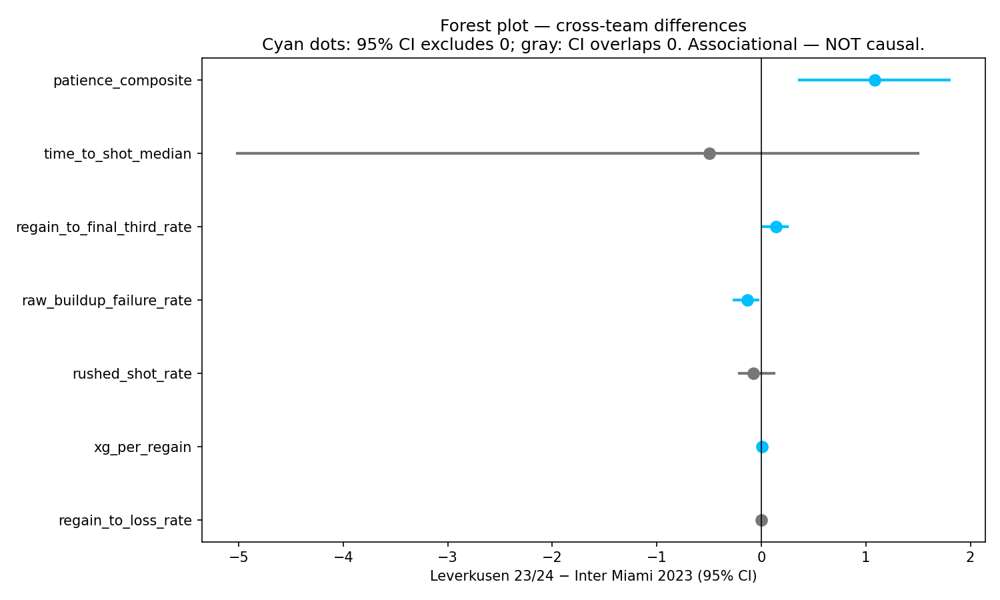

# Pressured Progression

**Two MLS failure modes — build-up collapse under pressure and post-regain waste — measured on Inter Miami 2023 (Messi's half-season, 6 matches) and benchmarked against Bayer Leverkusen 2023/24 (Alonso's unbeaten season, 34 matches) using StatsBomb Open Data and the American Soccer Analysis API.**


---

## What, how, finding

**What question does this answer?** When an elite attacking team is pressed deep in its own half, how often does its build-up collapse — and once the ball is won back, how often does that regain actually become a threat? These are two distinct failure modes football teams can fall into, and the project puts numbers on both of them for one MLS team and one European comparator that event-level open data can support.

**How was it measured?** Every on-ball event in 40 matches (6 Inter Miami, 34 Leverkusen) was parsed into possession chains via the StatsBomb schema. A build-up qualifies when it starts in the defensive third and faces opponent pressure within three actions; it's labeled a *failure* if it terminates via turnover, forced long ball, opponent shot within 10 seconds, or backward reset into a loss. A *regain* is a defensive action that flips possession to the focal team; the subsequent chain is measured for final-third entry, time-to-shot, and xG. Every team-season rate carries a match-resampled 95% bootstrap CI. An XGBoost classifier with SHAP attribution runs on Inter Miami's 73 qualifying chains as an illustrative (honestly small-n) model.

**The headline finding.** Inter Miami fails **34%** of qualifying build-ups under pressure (CI 25–45%) and produces **no shot within 15 seconds on 90%** of regains. Leverkusen sits materially better on four of seven cross-team metrics at 95% confidence — failure rate, final-third entry rate, xG per regain, and a composite patience score. The other three metrics (time-to-shot, rushed-shot rate, ≤4-action loss) are not separable from noise at this sample size. The full overlay is in `data/marts/leverkusen_overlay.csv`.

## Key findings

- **Inter Miami 2023 build-up failure rate:** 34% [95% CI 25–45%] across 73 qualifying chains in 6 matches.
- **Post-regain waste:** 90% of Inter Miami's 353 regains produced no shot within 15 seconds; median time-to-shot when shots happened was 5.5 s.
- **Leverkusen 2023/24 failure rate:** 21% [95% CI 16–25%] across 394 chains in 34 matches — a cross-team Δ of **−14 percentage points** (CI excludes zero).
- **Leverkusen final-third entry after regain:** 81% vs Inter Miami 67% — Δ of **+14 pp** (CI excludes zero).
- **Model utility is modest at small n.** XGBoost CV ROC-AUC 0.54 ± 0.08 on 73 chains; a LogReg baseline is marginally better. Reported honestly — no overstatement of what this model can predict.

## Sample visual

Cross-team difference forest plot (Leverkusen 23/24 − Inter Miami 2023, 95% bootstrap CI per metric). Cyan markers = CI excludes zero; gray = CI overlaps zero.



## Explore

- **Live dashboard:** *deploy to Streamlit Cloud — URL pending* (`streamlit run app/streamlit_app.py` locally)
- **One-page executive summary:** [`docs/executive_summary.pdf`](docs/executive_summary.pdf)
- **Full article draft:** [`docs/article_draft.md`](docs/article_draft.md)
- **Project spec:** [`docs/project_spec.md`](docs/project_spec.md)
- **Data reality audit:** [`docs/data_reality.md`](docs/data_reality.md)
- **Notebooks:** `notebooks/03_buildup_failure_model.ipynb`, `04_post_regain_metrics.ipynb`, `05_leverkusen_overlay.ipynb`, `06_inter_miami_case_study.ipynb`

## Reproduce

Requires Python **3.11+**.

```bash
# 1. clone and enter
git clone https://github.com/pressured-progression/pressured-progression.git
cd pressured-progression

# 2. venv
python -m venv .venv
# Windows:
.venv\Scripts\activate
# macOS/Linux:
source .venv/bin/activate

# 3. install
pip install -e ".[dev]"
pre-commit install

# 4. run the ingest + analysis pipeline
python -m pressured_progression.ingest.statsbomb
python -m pressured_progression.ingest.asa
python -m pressured_progression.ingest.asa_league_baseline
python -m pressured_progression.ingest.leverkusen_ingest
python -m pressured_progression.analysis.smoke_buildup_failure
python -m pressured_progression.analysis.run_buildup_pipeline
python -m pressured_progression.features.post_regain
python -m pressured_progression.analysis.leverkusen_overlay
python -m pressured_progression.analysis.build_case_study_figures
python -m pressured_progression.analysis.build_executive_summary

# 5. launch the Streamlit app
streamlit run app/streamlit_app.py

# 6. run the test suite
pytest
```

## Scope and limitations

This is not a full-MLS study. **Only Inter Miami has event-level data in MLS 2023 Open Data** (the 6-match Messi release); every other MLS team has zero Open Data matches in that season, so the project's original case-study pair (Philadelphia Union and Columbus Crew) cannot be measured here. The European analog was reduced to a single season — **Leverkusen 2023/24** — after a Phase 5 data audit found that Bundesliga 2022/23 is absent from Open Data, which killed a planned pre/post comparison. League context (2020–present) comes from the American Soccer Analysis API as team-season aggregates. Every reported metric is **associational** — no causal attribution to any coach, player, or tactical philosophy is supported. See [`docs/data_reality.md`](docs/data_reality.md) for the full coverage audit and every caveat this project is honest about.

## Data sources

| Source | Use | Access |
|---|---|---|
| [StatsBomb Open Data](https://github.com/statsbomb/open-data) | Event-level data (MLS 2023 Inter Miami; Bundesliga 2023/24 Leverkusen) | `statsbombpy` |
| [American Soccer Analysis v1 API](https://app.americansocceranalysis.com/api/v1/) | MLS 2020–present team-season aggregates | REST |
| [FBref](https://fbref.com/) | Intended for style-vector features | Attempted; Cloudflare-blocked scripted access (see `docs/data_reality.md` §3) |

## Author + contact

- **Author:** Ahmed Kali — `ahmedkali841@gmail.com`
- **Repo:** `github.com/pressured-progression/pressured-progression` *(placeholder until pushed)*
- **Article:** in draft — see [`docs/article_draft.md`](docs/article_draft.md)

Licensed under the [MIT License](LICENSE).
